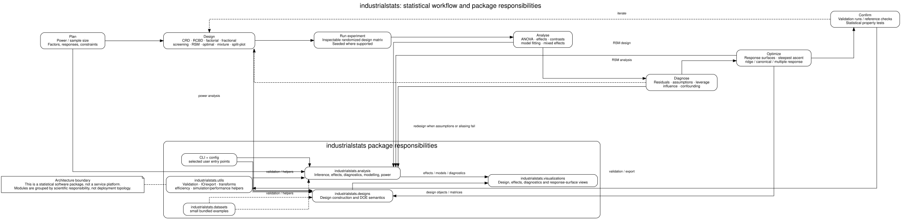
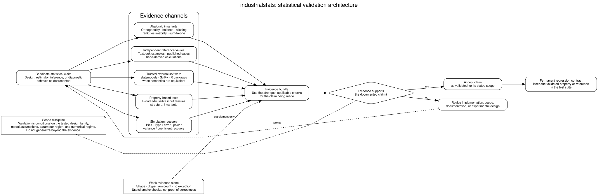

# Statistical architecture

`industrialstats` is a statistical software package, not a distributed service platform. Its architecture is therefore best described by **scientific responsibility** and by the designed-experiment lifecycle rather than by deployment containers.

Source: [`diagrams/statistical_architecture.dot`](diagrams/statistical_architecture.dot)

## Workflow model

The package is organized around the industrial experimentation cycle:

1. **Plan** — define factors, responses, constraints, power and sample-size requirements.
2. **Design** — construct randomized experiments using classical, screening, response-surface, optimal, mixture, or restricted-randomization designs.
3. **Run** — execute an inspectable design matrix with reproducible randomization where the design API supports a seed.
4. **Analyse** — estimate effects, fit models, compute ANOVA and contrasts, and use mixed-effects methods where appropriate.
5. **Diagnose** — test assumptions, inspect residuals, leverage, influence, confounding, and other threats to interpretation.
6. **Optimize** — use response-surface and related methods for steepest ascent, ridge/canonical analysis, and multiple-response optimisation.
7. **Confirm** — validate with follow-up runs, reference calculations, and statistical property tests before treating conclusions as established.

The arrows back from diagnosis and confirmation are deliberate. Designed experiments are iterative: assumption failures, confounding, weak estimability, or unsuccessful confirmation should trigger redesign rather than be hidden by increasingly elaborate modelling.

## Package responsibilities

| Package area | Responsibility |
| --- | --- |
| `industrialstats.designs` | Experimental-design construction and DOE semantics: factors, randomization, factorial/fractional designs, screening, RSM, optimal, mixture, CRD/RCBD and restricted designs. |
| `industrialstats.analysis` | Statistical inference and analysis: ANOVA, effects, diagnostics, model fitting, mixed effects, power and sample-size calculations. |
| `industrialstats.visualizations` | Reader-facing design, effects, diagnostic, prediction-variance and response-surface views. |
| `industrialstats.utils` | Cross-cutting validation, IO/export, transformations, design-efficiency, simulation and performance helpers. |
| `industrialstats.datasets` | Small bundled datasets used for examples and tests. |
| `industrialstats.cli` / `industrialstats.config` | Selected user entry points and configuration boundaries. |

The diagram does **not** imply that these subpackages are independent services. They are modules within one Python distribution and one in-process statistical workflow.

## Statistical boundary versus operational boundary

Mathematical precondition failures belong to the statistical code and should remain explicit. File loading, export and other operational failures use the package's DataExcept boundary where that adds useful semantics. This distinction prevents infrastructure exception handling from obscuring statistical errors.

Similarly, visualization is downstream of designs and analyses. Plots should expose a design or statistical result; they are not an independent source of statistical truth.

## Validation architecture

Source: [`diagrams/validation_architecture.dot`](diagrams/validation_architecture.dot)

The repository treats statistical validation as part of the architecture, not merely test coverage. Important methods should be checked through one or more of:

- algebraic invariants of the design matrix;
- independently derived reference values;
- comparisons with trusted external software or published examples;
- property-based tests;
- simulation recovery where exact closed-form checks are unavailable.

Shape and run-count tests alone are insufficient evidence for a DOE algorithm. The definitive-screening correction is an example of this policy: the implementation is now tested for orthogonality, estimability and foldover properties rather than only matrix dimensions.

The validation diagram also makes scope explicit: evidence supports only the design family, assumptions, parameter region and numerical regime that were actually tested. A validated result should become a permanent regression contract rather than an excuse to generalize beyond its evidence.

## Diagram maintenance

The editable sources live under `docs/diagrams/`. Rendered SVGs are committed under `docs/diagrams/rendered/` so GitHub and documentation-site readers do not need Graphviz installed.

The `Documentation diagrams` workflow regenerates every DOT source and fails when a committed render drifts from its source hash.
