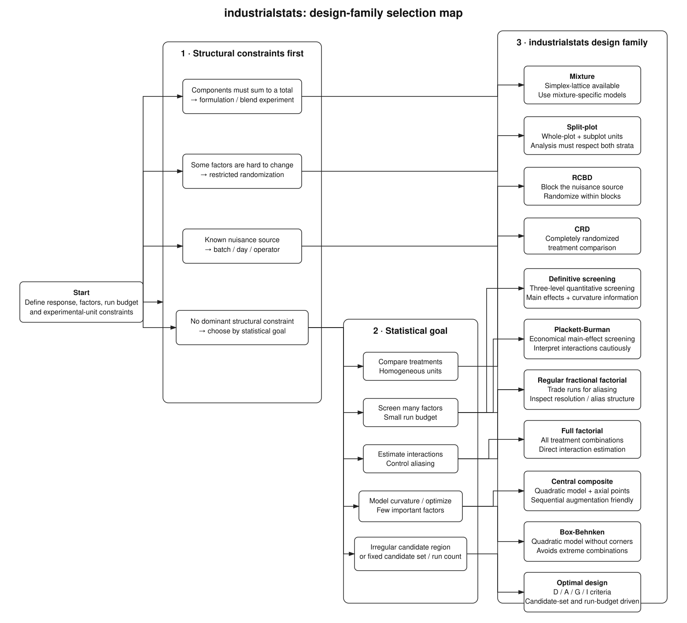
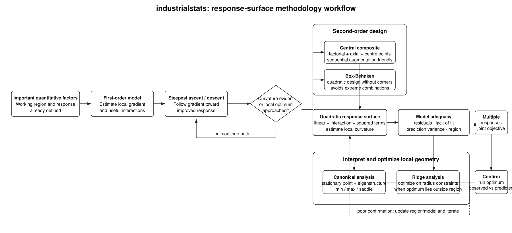
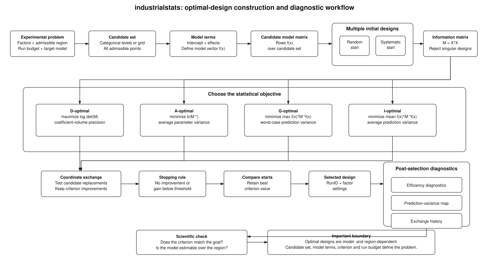
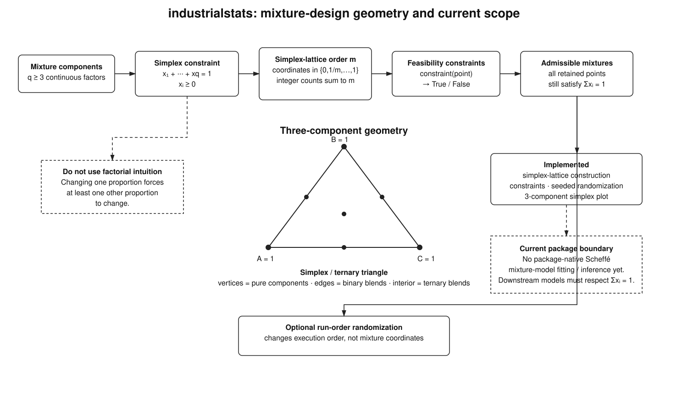

# Choosing a design

The right design depends on what stage of experimentation you are in, how many
factors you have, what randomization restrictions exist, and how many runs you can
afford.



Source: [`../diagrams/design_selection.dot`](../diagrams/design_selection.dot)

The map starts with structural constraints because they determine the experimental
unit. A mixture experiment, a split-plot experiment, and a blocked experiment are
not interchangeable with a completely randomized design even when they have a
similar run count. Once those constraints are respected, choose the design family
that matches the statistical goal.

## By experimental goal

| Goal | Typical situation | Design family |
| --- | --- | --- |
| Screen many factors | 6+ factors, few runs, want the vital few | Plackett-Burman, definitive screening, fractional factorial |
| Estimate main effects and interactions | 2–5 factors, moderate budget | Full factorial |
| Compare treatments | One factor, homogeneous units | Completely randomized design |
| Compare treatments with a nuisance source | Batches, days, operators | Randomized complete block design |
| Find an optimum | Few factors, curvature expected | Response surface (CCD, Box-Behnken) |
| Work under constraints | Irregular region, fixed run count | Optimal design (D, A, G, I) |
| Hard-to-change factors | Temperature changes are expensive | Split-plot |
| Formulation work | Components sum to a total | Mixture |

## Screening

With many factors and a small budget, start by finding which factors matter.

```python
from industrialstats.designs.base import Factor
from industrialstats.designs.screening import PlackettBurmanDesign

factors = [Factor(f"X{i}", [-1, 1], "continuous") for i in range(1, 8)]
design = PlackettBurmanDesign(factors, seed=42)
print(design.generate_design())
```

Plackett-Burman designs estimate main effects in very few runs, but their
interaction aliasing is complex. Treat the result as a shortlist, not as a
final model.

`DefinitiveScreeningDesign` is also available for three-level quantitative
screening when curvature information matters. Its current conference-matrix
construction is validated for the main-effect orthogonality, main-effect versus
two-factor-interaction orthogonality, pure-quadratic estimability, foldover symmetry,
and seeded randomization properties documented by the package. Mixed
continuous/two-level categorical DSDs remain outside the implemented scope.

## Factorials and resolution

A regular fractional factorial trades run count for aliasing. Its **resolution**
summarises the cost:

| Resolution | Meaning |
| --- | --- |
| III | Main effects aliased with two-factor interactions |
| IV | Main effects clear of two-factor interactions; those interactions aliased with each other |
| V | Main effects and two-factor interactions clear of each other |

Prefer resolution V when you intend to interpret interactions, and resolution
IV when you mainly need clean main effects.

```python
from industrialstats.designs.base import Factor
from industrialstats.designs.fractional_factorial import FractionalFactorialDesign

factors = [Factor(name, [-1, 1], "continuous") for name in "ABCDE"]

design = FractionalFactorialDesign(factors, fraction="1/2", randomize=False)
design.generate_design()
print(design.resolution_analysis())
```

That half fraction of five factors is 16 runs at resolution V, so every main
effect and two-factor interaction is estimable. Taking a quarter fraction
instead would halve the runs to eight but drop it to resolution III, aliasing
main effects with two-factor interactions — acceptable for screening, but not
if you intend to interpret interactions.

If a screening run leaves ambiguity, `foldover` augments the design to break
the aliases that matter.

## Response surface designs

Once the important factors are known and you expect curvature, move to a
response surface design.



Source: [`../diagrams/response_surface_workflow.dot`](../diagrams/response_surface_workflow.dot)

Response-surface methodology is sequential rather than a single design choice. A
local first-order model can guide steepest ascent or descent. Once curvature becomes
important, move to a second-order design, fit a quadratic surface, diagnose model
adequacy, interpret the local geometry with canonical or ridge analysis, optimize one
or several responses, and confirm the predicted operating point experimentally.

- **Central composite (CCD)** augments a factorial with axial and centre
  points. It estimates a full quadratic model and can be built from an existing
  factorial you have already run.
- **Box-Behnken** needs no extreme corner points, which helps when running all
  factors at their high settings simultaneously is impractical or unsafe.

```python
from industrialstats.designs.base import Factor
from industrialstats.designs.response_surface import ResponseSurfaceDesign

factors = [
    Factor("temperature", [180, 220], factor_type="continuous"),
    Factor("pressure", [10, 20], factor_type="continuous"),
]

design = ResponseSurfaceDesign(factors, design_type="CCD", center_points=4)
```

Centre points matter: they give a pure-error estimate and a lack-of-fit test.
Include several.

## Blocking

When a nuisance source such as batch, day, or operator varies during the
experiment, block on it rather than hoping randomization absorbs it.

```python
from industrialstats.designs.rcbd import RandomizedCompleteBlockDesign

design = RandomizedCompleteBlockDesign(
    treatments=["A", "B", "C"],
    blocks=["Day1", "Day2", "Day3"],
    blocking_factor="Day",
    seed=42,
)
```

For regular two-level factorials, treatment-defined block generators are a
different mechanism from RCBD nuisance blocking. The package exposes their defining
contrasts and confounded effects explicitly rather than assigning blocks by row
position.

## Optimal designs

When the design region is constrained, the run budget is fixed, or the model is
non-standard, a coordinate-exchange search over a candidate set is more
appropriate than a catalogue design.



Source: [`../diagrams/optimal_design_workflow.dot`](../diagrams/optimal_design_workflow.dot)

An optimal design is defined jointly by the candidate region, the target model,
the run budget, and the criterion. `industrialstats` builds the corresponding model
matrix, rejects singular information matrices, searches candidate replacements by
coordinate exchange, compares multiple starting designs, and retains the best
criterion value. The resulting design should then be checked with efficiency and
prediction-variance diagnostics rather than treated as optimal independently of the
model assumptions that created it.

The available criteria answer different statistical questions:

- **D-optimality** maximizes `log det(X.T @ X)` and targets joint coefficient precision.
- **A-optimality** minimizes the trace of the inverse information matrix and targets average parameter variance.
- **G-optimality** minimizes the worst prediction variance over the candidate set.
- **I-optimality** minimizes the mean prediction variance over the candidate set.

Choose G or I when prediction across the region is the primary goal, and D or A
when coefficient estimation is the priority. Changing the model terms, candidate
set, criterion, or run budget defines a different optimization problem.

## Mixture designs

Mixture experiments are structurally different from ordinary factorial experiments
because component proportions are constrained by

\[
\sum_{i=1}^{q} x_i = 1,
\qquad x_i \ge 0.
\]



Source: [`../diagrams/mixture_geometry.dot`](../diagrams/mixture_geometry.dot)

For three components, the feasible region is a triangle: vertices are pure
components, edges are binary blends, and interior points are ternary blends.
`MixtureDesign` currently generates simplex-lattice points, filters them through
optional feasibility constraints, can randomize the retained run order with a seed,
and can plot the three-component simplex.

```python
from industrialstats.designs.advanced import MixtureDesign
from industrialstats.designs.base import Factor

components = [
    Factor("A", [], "continuous"),
    Factor("B", [], "continuous"),
    Factor("C", [], "continuous"),
]

design = MixtureDesign(components, order=2, randomize=True, seed=42)
mixtures = design.generate_design()
```

Do not analyse the component proportions as independent factorial factors. If one
component changes, at least one other component must change to preserve the simplex
constraint. The current package provides mixture-design construction and
visualization, but not a package-native Scheffé mixture-model fitting/inference
layer; any downstream model must respect the compositional constraint explicitly.

## Randomization and reproducibility

Every generator that exposes a `seed` should be run with that seed recorded
alongside the experiment. Reproducibility depends on the exact design family and
its randomization contract rather than on reordering a generated table later.

Where randomization must be restricted — as in split-plot designs, where whole
plots are hard to change — use the design family that encodes that restriction
rather than reordering a fully randomized design by hand. The analysis has to
match the randomization structure to give correct standard errors.
