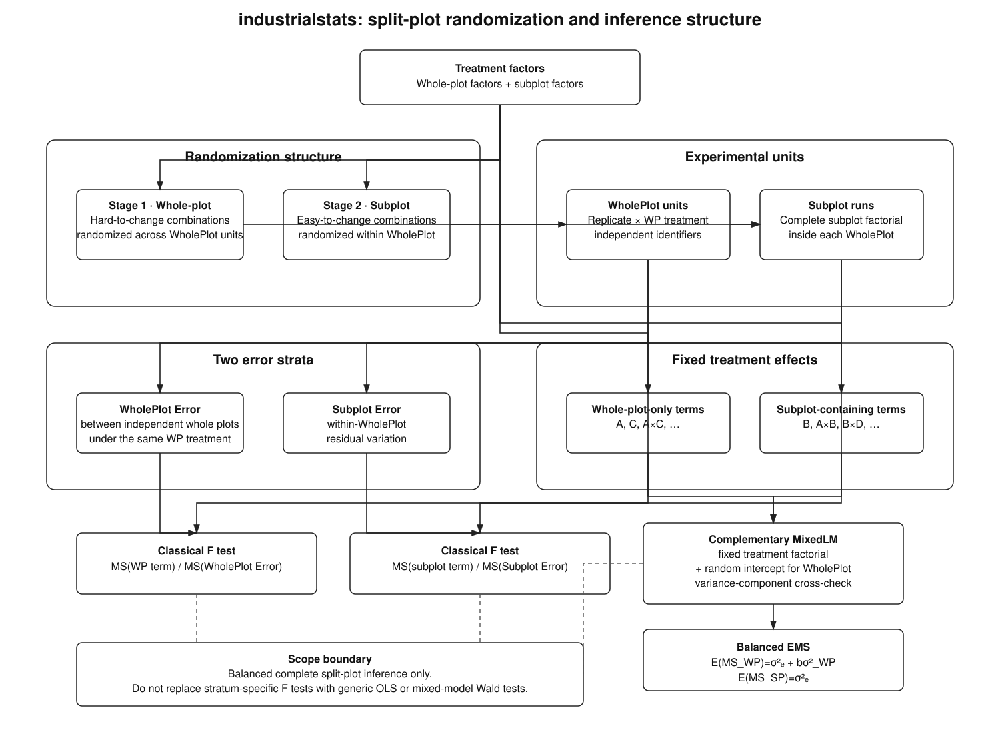

# Analysis

Statistical analysis of collected experimental results.

## ANOVA

::: industrialstats.analysis.anova

## Split-plot inference

Split-plot experiments have two randomization stages and therefore two error strata. Whole-plot-only treatment terms must be tested against whole-plot error; terms containing subplot factors must be tested against subplot error.

Source: [`../diagrams/split_plot_inference.dot`](../diagrams/split_plot_inference.dot)

The classical stratum-specific F tests and the random-intercept mixed model answer complementary questions. A generic OLS residual denominator is not valid for whole-plot treatment effects, and mixed-model Wald tests are not substituted for the classical balanced split-plot F tests.

::: industrialstats.analysis.split_plot

## Effects

::: industrialstats.analysis.effects

## Model fitting

::: industrialstats.analysis.model_fitting

## Diagnostics

::: industrialstats.analysis.diagnostics

## Power analysis

::: industrialstats.analysis.power_analysis
