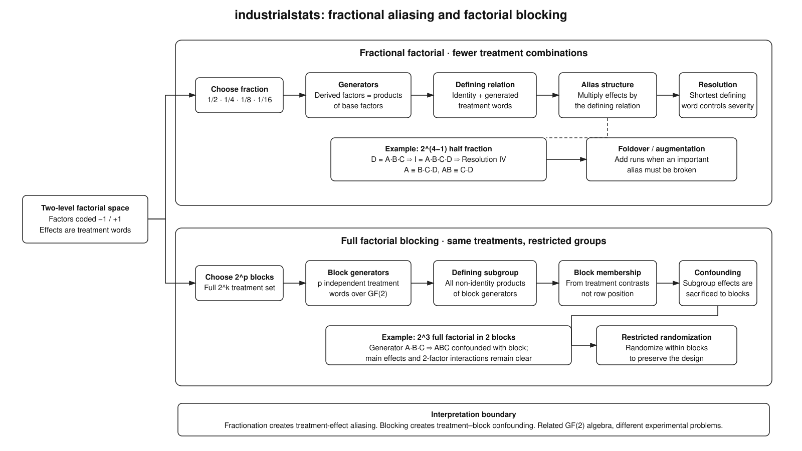

# Designs

Design generators. Every design is constructed from
[`Factor`](#industrialstats.designs.base.Factor) objects and produces a pandas
design matrix from `generate_design()`.

## Factorial aliasing and blocking

Source: [`factorial_aliasing_blocking.dot`](../diagrams/factorial_aliasing_blocking.dot)

Regular two-level fractions and regular factorial blocks both use treatment
words and algebra over $\mathrm{GF}(2)$, but they solve different problems.
A fractional factorial deliberately omits treatment combinations, so its
defining relation determines which treatment effects are aliased. Resolution
and the word-length pattern summarize how severe those aliases are, and
foldover can add runs when a particular ambiguity matters.

Blocking keeps the full factorial treatment set but partitions it into
restricted groups. The independent block generators produce a block-defining
subgroup; treatment effects in that subgroup are intentionally confounded with
blocks. `FactorialDesign.block_structure()` exposes that choice explicitly, and
run-order randomization then occurs within blocks rather than destroying the
restriction.

## Base

::: industrialstats.designs.base

## Full factorial

::: industrialstats.designs.factorial

## Fractional factorial

::: industrialstats.designs.fractional_factorial

## Completely randomized design

::: industrialstats.designs.crd

## Randomized complete block design

::: industrialstats.designs.rcbd

## Screening

::: industrialstats.designs.screening

## Response surface

::: industrialstats.designs.response_surface

## Optimal designs

::: industrialstats.designs.optimal

## Advanced designs

::: industrialstats.designs.advanced
